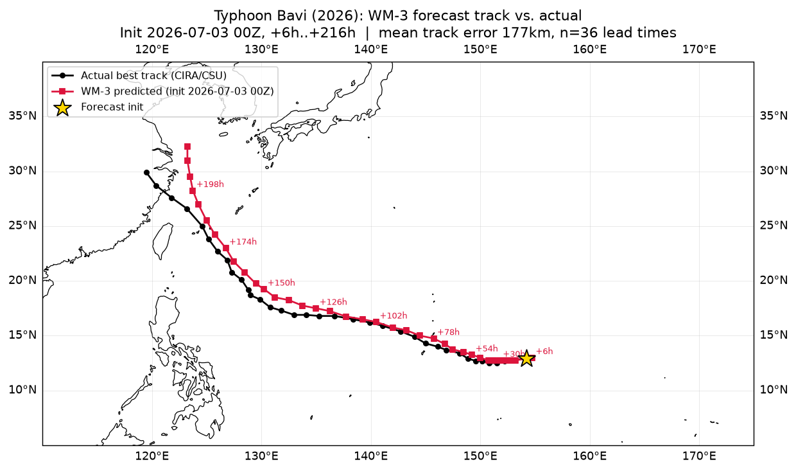
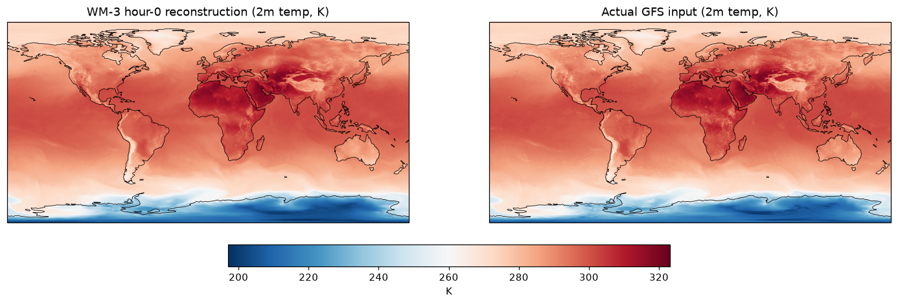
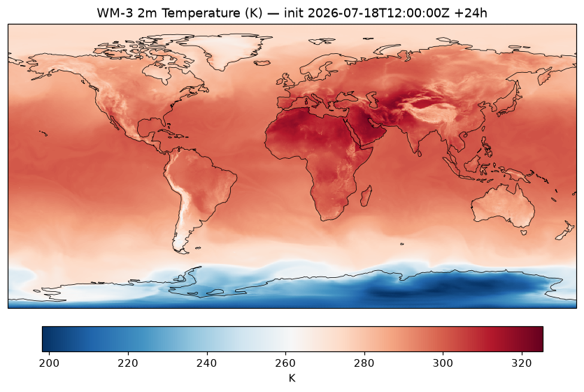
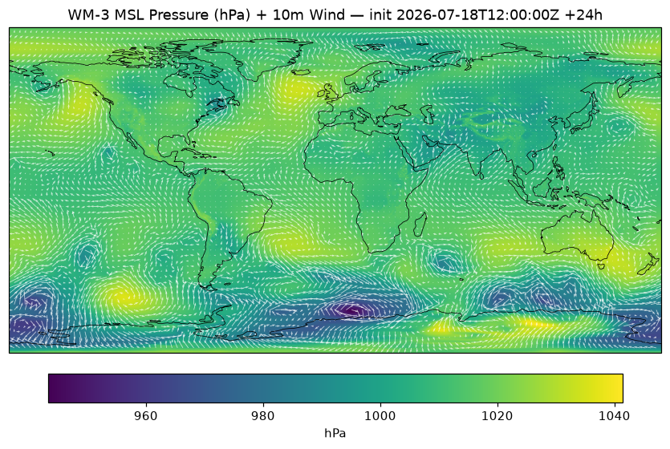

# WeatherMesh-3 Inference Pipeline — Writeup

Repo: https://github.com/raoashish10/WeatherMesh-3

## (a) Evidence to show the inference worked correctly

Three plots from a live rollout on real, freshly-pulled GFS data (2026-07-18 12z init). Full images in `docs/plots/`.

1. **A real 9-day forecast of Typhoon Bavi (2026), checked against what really happened**
   - Everything above is a self-consistency check. This one is a genuine forecast verified against an event that isn't in the model's training distribution's future.
   - Init 2026-07-03 00Z (from NOAA's archived GFS, ~60h before Bavi's peak intensity), rolled out to +216h (9 days, through the July 11 China landfall).
   - Storm tracked via the MSL pressure minimum at each lead time, checked against real 6-hourly best-track data from CIRA/CSU's tropical cyclone tracker.
   - Mean track error: 177km, median 182km across 36 matched lead times degrading roughly with lead time like a genuine forecast should.
   - Full methodology and data provenance in §(b)(ii).

   

1. **hour-0 reconstruction vs. actual input**
   - I ran WM-3 with encode and decode only for reconstruction validation (no processor step) and compared it to the raw GFS input I'd just fed in.
   - If anything in the pipeline were broken like wrong channel order, bad normalization, wrong grid, then this would look nothing like the input.
   - Mean absolute difference: 0.7K. Visually near-identical, which means that the reconstruction itself works correctly.

   

2. **2m temperature, +24h**
    - Usual temperatures are matched for July
      - Northern Hemisphere warm
      - Antarctic cold
      - Sahara/Middle East hot matches the season.
   - Sharp output, not smudged or blurred (which was the problem with MLWP models).

   

3. **MSL pressure + 10m wind, +24h**
  - Realistic pressure belts: 
    - subtropical highs
    - storm-track lows in the southern winter ocean.
  - Coherent wind field.

   

## (b) Answers

### i. How I picked the provider and node, and what I'd change for 99.9% uptime

**How I chose the node**:
- Why RTX 4090?
  - The WM-3 paper reports its headline number (a 14-day forecast in 12 seconds) on a single RTX 4090, and says the model runs on hardware as light as a 16GB-VRAM laptop.
  - Even WM-3's own training run used 6 RTX 4090s, not datacenter GPUs.
  -  Some headroom (used 24GB instead of 16GB) above the stated floor in the paper mattered because it's what absorbed a batched-decode OOM error I hit during validation (see (b)(ii)) without needing to shard anything.

- What actually narrowed my search for GPU templates/specs was software pinning:
  - `natten==0.17.3+torch240cu121` requires exactly PyTorch 2.4.0 + CUDA 12.1.
  - I filtered hosts on that CUDA/driver compatibility first, then the 24GB tier, then cost.

**How I chose the provider**:
- I went with vast.ai because of the $50 hard cap. Its peer-to-peer pricing beats Lambda/RunPod/hyperscalers. 
- Another reason was also that I had asked Anuj Shetty about where current infra is hosted.
- Trade-off: More host-quality variance due to peer-to-peer. I mitigated this by checking each listing's reliability score and recent uptime before renting.
- Since the pipeline needed to keep running 24h+ after submission, I rented on-demand, not spot/interruptible because preemption would've silently broken that requirement mid-cycle.

**What I'd change for 99.9% uptime in production**  

- Honestly, this setup (one box, cron, local disk) doesn't get you there:
  - Managed GPU orchestration (GKE/EKS GPU node pools, or a platform like Modal/Baseten) instead of a single SSH'd-into box for availability during scheduled runs.
  - Reserved/on-demand capacity, not spot, for the serving path.
  - Decoupled job scheduling (Airflow/Prefect/Temporal) instead of cron running on same instance, 
    - If a run is stuck, it doesn't block the next cycle and retries/backfills are first-class.
  - Multi-region failover (especially after the not so long ago us-east-1 collapse for AWS) and real alerting/on-call.

### ii. Sanity checks I ran

- **Hour-0 reconstruction vs. actual input** (plot 1 above), the strongest correctness signal I have. 
  - If channel ordering, normalization, or the level-interpolation step were wrong, this wouldn't come close to matching.

- **+24h label check**
  
  - Since this checkpoint only has a 6-hour processor, "+24h" means 4 chained P6 steps (`E,P6,P6,P6,P6,D`, confirmed from `simple_gen_todo([24],[6])`). I generated +24h twice, independently:
  - once in a 6-target call, once in a separate 60-target call, ~20 min apart, different processes.
  - The two outputs are byte-for-byte identical (same MD5, 0 max abs diff across every variable).
  - This rules out a single-step shortcut or a stale/cached file.

- **Accuracy vs. real ground truth (Typhoon Bavi, 2026)** (`scripts/validate_cyclone.py`, `pipeline/cyclone_track.py`)
  - Everything else here is self-consistency. This is the one check against something that actually happened, so I didn't just trust the storm data blindly, I cross-checked it against Wikipedia, JTWC's reported peak intensity, and Yale Climate Connections. Best-track data is from CIRA/CSU, saved in `docs/bavi_2026_besttrack.json`.
  - NOMADS only keeps ~10 days of live data, so a July 3 init meant pulling from NOAA's archived GFS instead (`noaa-gfs-bdp-pds`).
  - Rolled out 9 days from the 2026-07-03 00Z init (36 lead times, through the July 11 China landfall). At each lead time, found the MSL pressure minimum near the storm's known position and measured great-circle distance to the real track.
  - Mean track error: 177km, median 182km, max 442km. That's in the range real operational forecasts get, and it degrades with lead time like a real forecast should, not flat or erratic.
  - One caveat: WM-3's pressure minimums run a bit shallow next to Bavi's true ~901hPa peak, likely just under-resolving the eyewall at 0.25° grid spacing.
  - Uploaded through the same S3 path as the scheduled runs, all 36 files verified against the bucket listing.

- **Plausibility bounds** (`pipeline/validate.py`), run across the full 60-lead-time (+6h to +360h) production schedule:
  - 2m temp/dewpoint in [180,340]K
  - MSL pressure in [87000,110000]Pa
  - 10m/100m wind < 120 m/s
  - dewpoint ≤ temperature
  - cloud cover ∈ [0,1]
  - atmospheric temp in [180,320]K
  - geopotential(10hPa) > geopotential(1000hPa)
  - specific humidity in [-0.001,0.025] kg/kg
  - NaN/Inf checks on every variable

- **Geo-clustering of validation flags**, 
I dug into this instead of writing it off:
  - The full-schedule run produced 91 boundary flags, all in exactly two checks (atm temp slightly >320K, humidity slightly >0.025 kg/kg).
  - I pulled the lat/lon of every flagged pixel.
  - 100% of humidity flags: Arabian Peninsula/Persian Gulf — famous for extreme summer dewpoints.
  - Temperature flags: Sahara, Arabian Peninsula, Turkmenistan/Uzbekistan (Karakum desert), Xinjiang's Turpan Depression (China's hottest recorded location).
  - All at 950–1000hPa (surface), never upper levels.
  - Conclusion: real July desert heat can be observed.

- **Visual sharpness** — plots show sharp detail (coastlines, terrain-driven temperature gradients), not smudged/blurred output.

- **Two real bugs I found and fixed during validation** (not just "it ran without erroring"):
  1. GFS reports total cloud cover as 0–100%. The model's normalization stats expect a 0–1 fraction. 
  I caught this because decoded cloud cover came out with mean ~7 instead of ~0.07.

  2. GPU OOM on the full 60-lead-time rollout 
  - Decoded outputs for all 60 lead times were staying resident on GPU simultaneously (~35GB). 
  - Fixed this via `forward(..., send_to_cpu=True)`. Basically offloading them to CPU to save memory.

- **Self-consistency check (6×1hr vs 1×6hr) was not possible.** 
  - I'd planned this initially, but the actual checkpoint (`weights/WeatherMesh3.pt`) only contains a 6-hour processor which I understood after I checked its `state_dict` keys directly and there's no `"1"` key. 
  - If the 1-processor would have been available, I would do this check.

## (c) Time log

Full log in `TIME_LOG.md`. Git history backs it up directly (`git log 8b84ebd..HEAD`. Condensed:

| time (UTC) | what |
|---|---|
| 17:16 | Repo present; confirmed architecture facts against source (721-row storage vs. 720-row model mesh, `load_weights()` location, no denormalize function in the open-sourced repo, etc.) |
| 17:2x–17:5x | Env setup (worked around an expired TLS cert for the NATTEN wheel install; matepoint; cfgrib); downloaded weights + sample data |
| 17:54–18:09 | First model load + rollout on sample data works clean; denormalize + NetCDF postprocessing; switched to int16-packed NetCDF (161 files/cycle didn't fit disk otherwise) |
| 18:09–18:18 | Built NOAA NOMADS ETL (replacing WindBorne API, which needed approval I didn't have time for); found + fixed the cloud-cover unit bug |
| 18:18–18:35 | Validation + 3 plots; cron automation; GCS-ready storage layer (deferred, not wired to a real bucket); Dockerfile; README |
| 18:37–19:06 | Confirmed a real full-cycle benchmark (found + fixed a GPU OOM along the way); ran geo-clustering analysis on validation flags; tightened alerting to NaN/Inf only; verified cron wrapper end-to-end via direct invocation; added per-cycle eye-check plots |
| 19:06–onward | Wired up S3 and verified it end-to-end (real upload checked against bucket listing); switched cycle naming from raw unix timestamps to readable `YYYYMMDD_HHz`; ran a full production run (60 files + plots) to S3 for the most recent GFS cycle |

## (d) AI tools I used

- **Claude Code did essentially all the implementation work** in this session:
  - Read the vendored architecture repo to resolve ambiguities my earlier research got wrong specifically the 721 vs 720 grid nuance, the 25/20 to 28-level interpolation step and the fact this checkpoint only has a 6-hour processor.
  - Wrote the ETL/model/postprocess/validation/automation code.
  - Ran it against a real GPU and real NOMADS data, and debugged the two real bugs above.
  - Iterated on direct pushback from me. This writeup exists because I asked it to verify that the OOM fix actually preceded the reported benchmark numbers, checked against raw logs.

- **Before this session, I used Claude.ai** for upfront research: reading the WM-3 paper/repo, drafting the infra plan (vast.ai, Docker base image, output schedule), and the validation-bounds plan. That research is what this session's brief was built from — this session corrected several details against the live repo/checkpoint where my earlier research didn't match reality.

## (e) Output storage

- S3: `s3://windbornesystem-mlops-assignment/` (public bucket, us-east-2)
- One key per file: `<YYYYMMDD_HHz>/wm3_f<NNN>.nc`
- Wired into the production pipeline (`pipeline/storage.py`, `scripts/cron_cycle.sh` exports `S3_BUCKET`)
- I confirmed it works end-to-end: a real upload through `run_live_rollout.py` (not just a standalone boto3 call), listed back from the bucket to check the objects and sizes match
- Outputs also stay on local disk (`outputs/<YYYYMMDD_HHz>/wm3_f<NNN>.nc`, pruned to the 2 most recent cycles) as a working cache — S3 is the durable store

## (f) Repo

https://github.com/raoashish10/WeatherMesh-3 — setup instructions, Dockerfile, and a documented list of deviations from a literal WindBorne-API-based pipeline are in `README.md`.

## (g) With more time

- Parallelize NetCDF postprocessing across CPU cores — it's the dominant cost (~13s/file, 776s of the 892s full-cycle wall-clock), it single-threaded right now.
- Actually build and run the Docker image on a non-nested GPU host (couldn't test it here due to limitations within the vast.ai instance for running docker alongside).
- Get real WindBorne API access and compare its GFS ICs against the NOMADS ones I used here.
- Extend the cyclone validation beyond track position: compare predicted intensity (min pressure, max wind) against best-track more rigorously and run it against a second/third storm to see if the ~177km mean error and the apparent shallow-pressure bias generalize or are specific to Bavi.
- The eastward track bias visible in the Bavi plot (predicted track consistently a bit east of actual through the recurve) is a one-storm data point. I would check with more cases.

## (h) Feedback on the assignment

Not much to add here, honestly. I had fun understanding the model and figuring out bugs for myself. If it would have been possible to use the Windborne API for GFS data, that would be a good data source I believe.